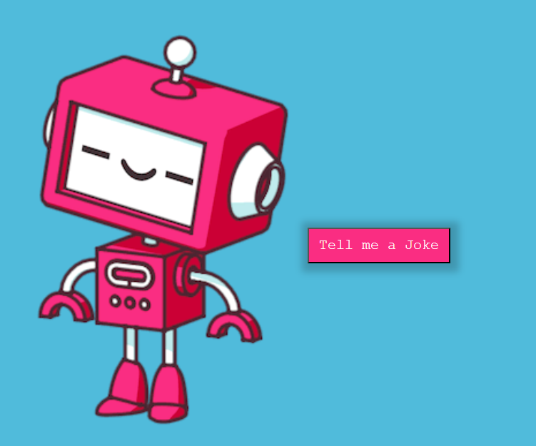

# Tell-Me-A-Joke
A Robot that tells you a joke,, built with JavaScript
<a name="readme-top"></a>


  
  <br/>

  <h3><b># Tell-Me-A-Joke</b></h3>

</div>

# 📗 Table of Contents

- [📖 About the Project](#about-project)
  - [🛠 Built With](#built-with)
    - [Tech Stack](#tech-stack)
    - [Key Features](#key-features)
  - [🚀 Live Demo](#live-demo)
- [👥 Authors](#authors)
- [🔭 Future Features](#future-features)
- [🤝 Contributing](#contributing)
- [⭐️ Show your support](#support)
- [🙏 Acknowledgements](#acknowledgements)
- [📝 License](#license)

# 📖 Recipe-App <a name="about-project"></a>

**Joke-teller** 
Introducing the Joke-Teller App: Your new go-to source for laughter and amusement! This innovative application has been crafted with the power of vanilla JavaScript, seamlessly integrating two dynamic APIs - the Rapid API Text-to-Speech and the Joke Teller API.

Ever wished you had your very own personal comedian, just like Siri, Cortana, or other voice assistants? Well, look no further! The Joke-Teller App is designed to tickle your funny bone and brighten your day with a quick dose of humor.

With a simple click or voice command, this app brings you a wide range of rib-tickling jokes, narrated with the charm of a virtual assistant. Whether you're in need of a quick laugh or looking to share a joke with friends, the Joke-Teller App 
is here to keep you entertained. Get ready to have your spirits lifted and your smile broadened as you experience the delightful world of humor brought to life by this engaging application. Say goodbye to boredom and hello to endless laughter with the Joke-Teller App!

## 🛠 Built With <a name="built-with"></a>
- JavaScript
- Webpack
- Rapid API
- HTML/CSS


<p align="right">(<a href="#readme-top">back to top</a>)</p>

## 🚀 Live Demo <a name="live-demo"></a>

- [Live Demo Link](https://karanj2212.github.io/Tell-Me-A-Joke/) 

<p align="right">(<a href="#readme-top">back to top</a>)</p>

## 💻 Getting Started <a name="getting-started"></a>

To get a local copy up and running, follow these steps.

### Prerequisites

In order to run this project you need:

- Node.js & npm
- A web browser


### Setup

Navigate to your desired folder and enter these commands:


```sh
  git clone git@github.com:myaccount/recipe-app.git
  cd recipe-app
```


### Install

Install all dependencies with:

```sh
  npm i
```


### Usage

To run the project, execute the following command:

```sh
  npm start
```

<p align="right">(<a href="#readme-top">back to top</a>)</p>

## 👥 Author <a name="authors"></a>

👤 **Karan Jain**
- GitHub: [@karanj2212](https://github.com/karanJ2212)
- LinkedIn: [@karanjain2212](https:/www.linkedin.com/in/karanjain2212/)


<p align="right">(<a href="#readme-top">back to top</a>)</p>

## 🔭 Future Features <a name="future-features"></a>

- [ ] **UI Improvement**
- [ ] **Mobile version**

<p align="right">(<a href="#readme-top">back to top</a>)</p>

## 🤝 Contributing <a name="contributing"></a>

Contributions, issues, and feature requests are welcome!

Feel free to check the [issues page](https://github.com/karanJ2212/Tell-Me-A-Joke/issues).

<p align="right">(<a href="#readme-top">back to top</a>)</p>

## ⭐️ Show your support <a name="support"></a>

If you like this project, please give it a star ⭐

<p align="right">(<a href="#readme-top">back to top</a>)</p>

## 🙏 Acknowledgments <a name="acknowledgements"></a>
Special thanks to all the assistance received!

<p align="right">(<a href="#readme-top">back to top</a>)</p>

## 📝 License <a name="license"></a>

This project is [MIT](./LICENSE) licensed.

<p align="right">(<a href="#readme-top">back to top</a>)</p>
